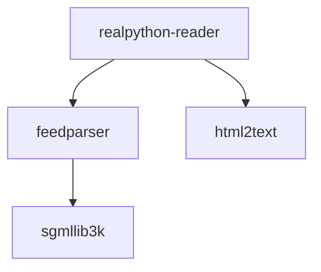

Python 3.9 introduces `graphlib`. This library is used for sorting a graph of nodes topologically.

For example below you have a graph of the dependencies needed to install `realpython-reader`. To install `realpython-reader` we first need to install `sgmlib3k`, then `feedparcer` and `html2text` and finally we can install `realpython-reader`. Getting this order is called **topological sorting** and can be done wit the `graphlib` library.




```python
>>> # first we construct the graph
>>> # each key in the dictionary represents part of the graph
>>> # note that after key is a set not a dictionary
>>> dependencies = {
...   "realpython-reader":{"feedparser", "html2text"},
...   "feedparser":{"sgmllib3k"},
... }
>>> from graphlib import TopologicalSorter
>>> sorter = TopologicalSorter(dependencies)
>>> sorter.static_order()
<generator object TopologicalSorter.static_order at 0x104743d60>
>>> list(sorter.static_order())
['html2text', 'sgmllib3k', 'feedparser', 'realpython-reader']
```

A few notes on the above:

* The output is not the only valid answer. For topological sorting the result does not have to be unique.